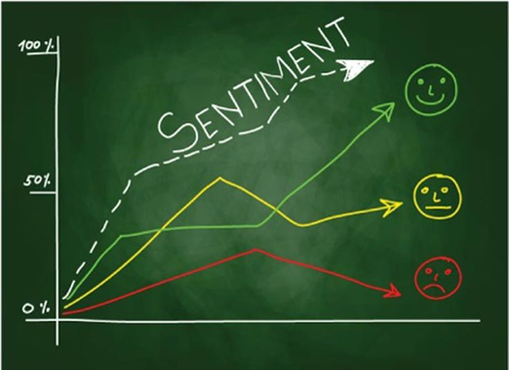

# Twitter Sentiment Analysis

## Project Overview
In a dynamic digital landscape, understanding public sentiment towards technology giants like Apple and Google is paramount. This project aims to harness the power of Natural Language Processing (NLP) to conduct a comprehensive sentiment analysis of tweets related to their products. By leveraging a dataset containing over 9,000 manually annotated tweets, we seek to create a robust model that discerns sentiments as positive, negative, or neutral. The multifaceted nature of this analysis offers valuable insights for businesses, marketing strategists, and researchers invested in the consumer electronics domain.

### Business Understanding
In the era of social media dominance, the reputation and perception of tech companies can be heavily influenced by user-generated content. Understanding the sentiment expressed on platforms like Twitter provides a unique opportunity to gauge public perception, inform strategic decisions, and enhance customer engagement strategies. By delving into the sentiment surrounding Apple and Google products, businesses can gain actionable insights, refine their marketing approaches, and maintain a pulse on the evolving consumer landscape.

#### Objectives

- To identify unique words associated with positive, negative, and neutral sentiments in the dataset.

- Initiate the project with a focused binary classifier to distinguish positive and negative sentiments. Gradually extend the model's capabilities to handle neutral sentiments, ensuring a robust multiclass classification system(Proof of Concept).

- Develop a sophisticated NLP model capable of accurately classifying tweet sentiments as positive, negative, or neutral, providing nuanced insights into the public's opinions(Sentiment Analysis). The criterion for building a "sophisticated model" is that the model should have an acceptable accuracy of 80% and above. Also it should be able to differentiate between the 3 target classes.

##### Challenges

- Social media platforms are rife with diverse language patterns, including slang, abbreviations, and evolving expressions. These nuances pose a challenge for the sentiment analysis model, as it must accurately interpret informal language to discern sentiments.
- The neutral sentiment category often encapsulates a broad range of opinions that can be subtly positive, slightly negative, or completely neutral. Distinguishing and accurately classifying these nuanced sentiments within the neutral category can be challenging.

###### Solutions

- Implement a robust text preprocessing pipeline that includes tokenization, lemmatization, and handling of slang and abbreviations. Additionally, explore the integration of word embeddings or contextual embeddings to capture the contextual meaning of words within the dynamic social media landscape.
- Develop a more granular approach to neutral sentiment classification. Consider exploring sentiment intensity analysis within the neutral category, leveraging techniques like sentiment lexicons or machine learning models specifically trained for nuanced sentiment detection. Regular model evaluations and updates based on user feedback can further enhance the model's ability to discern subtle sentiment variations.

###### Problem Statement:
The challenge at hand is to develop an NLP model that accurately discerns sentiments within a vast array of tweets related to Apple and Google products. The model must address the intricacies of social media language, varying sentiment intensity, and the challenge of handling a three-class classification system. The ultimate goal is to provide a tool that offers nuanced insights into public sentiment, aiding businesses in making informed decisions.

#### Data Understanding:

 The dataset, curated from CrowdFlower via data.world, comprises over 9,000 manually rated tweets. This wealth of labeled data serves as the foundation for training and validating our sentiment analysis model. 

 The dataset, comprises 9,093 tweets with three key columns ('tweet_text,' 'emotion_in_tweet_is_directed_at,' and 'is_there_an_emotion_directed_at_a_brand_or_product'), and plays a pivotal role in achieving the objectives of our sentiment analysis project focused on Apple and Google products.

The tweet_text column contains the raw text of tweets, serving as the primary data source for training our Natural Language Processing (NLP) model. By analyzing the language expressions within these tweets, we aim to build a robust sentiment analysis tool capable of discerning whether sentiments expressed are positive, negative, or neutral.

The emotion_in_tweet_is_directed_at column is instrumental in understanding the context of sentiment. It specifies the brand or product towards which the emotion in the tweet is directed, allowing our model to associate sentiments accurately with either Apple, Google, or other relevant brands. This information ensures the contextual relevance of sentiment predictions.

Finally, the labels in the is_there_an_emotion_directed_at_a_brand_or_product column represent the ground truth for our model. Manually assigned sentiments—positive, negative, or neutral—provide the training framework for our sentiment analysis model. The accuracy of these labels is crucial for the model to learn and generalize sentiment patterns effectively.

The dataset's overall significance lies in its alignment with our project's overarching goals. By leveraging these 9,093 manually labeled tweets, we aim to develop a sophisticated NLP model capable of accurately categorizing sentiments in tweets related to Apple and Google products. The dataset serves as the foundation for training, validating, and fine-tuning our model, ensuring it captures the nuances of public opinion on social media.

 Understanding the nuances within this dataset is paramount for informed preprocessing, feature extraction, and model training strategies. The exploration and comprehension of this dataset will be pivotal in shaping the success of the sentiment analysis project.

#### Data Cleaning and Preparation:
In the process of cleaning the data, the first step involved handling duplicate entries within the 'tweet_text' column. This was achieved by removing identical rows, resulting in a cleaned DataFrame comprising 9065 entries and three columns: 'tweet_text,' 'emotion_in_tweet_is_directed_at,' and 'is_there_an_emotion_directed_at_a_brand_or_product.' Subsequent to this, a thorough overview was provided, presenting non-null counts and unique values for each column to offer a comprehensive perspective on the dataset.

 Following the handling of duplicates, attention was directed towards managing null values. Initial assessments revealed one null value in the 'tweet_text' column and a substantial count in 'emotion_in_tweet_is_directed_at.' In response, null values in the 'tweet_text' column were promptly eliminated, contributing to a more refined dataset.

A scrutiny of data types and memory usage indicated that the columns predominantly featured 'object' data types, with an overall memory usage of approximately 283.3 KB. Additional cleaning procedures were implemented using regular expressions to further refine the 'tweet_text' column. This involved the removal of user mentions, links, and non-alphanumeric characters, enhancing the overall cleanliness of the textual data.

As the data cleaning process unfolded, a continued examination of missing values was conducted. Notably, 'emotion_in_tweet_is_directed_at' exhibited a significant number of missing values. However, at this stage, no immediate action was taken, and these missing values were retained for subsequent analysis.

To refine the textual content within the 'tweet_text' column, a specialized function, 'clean_tweet_text,' was introduced. Leveraging regular expressions, this function contributed to the systematic cleaning of tweet text, ensuring a more standardized and streamlined textual representation.

In addition to text cleaning, the process involved the extraction of hashtags from the tweet text. A dedicated function, 'extract_hashtag_words,' was incorporated for this purpose, resulting in the creation of two new columns: 'clean_text,' representing the cleaned tweet text, and 'hashtags,' containing the extracted hashtags.

In summary, the data cleaning process encompassed the removal of duplicates, handling of null values, application of regular expressions for text cleaning, and extraction of relevant information such as hashtags. These steps collectively contributed to the creation of a more refined and organized dataset, setting the stage for subsequent analyses.

#### Exploratory Data Analysis and Visualization
In the exploratory data analysis (EDA) phase, an in-depth examination of the dataset was conducted, primarily focusing on three key columns: 'tweet_text,' 'emotion_in_tweet_is_directed_at,' and 'is_there_an_emotion_directed_at_a_brand_or_product.' A distribution analysis of these columns provided valuable insights into the patterns and sentiments expressed in the dataset.

The 'tweet_text' column was explored to understand the distribution of unique tweets, revealing a diverse array of content with 9065 distinct entries. Each tweet was associated with varying levels of emotional expression, and the frequency of the emotions expressed within the tweets towards the products was observed.

Further exploration delved into the distribution of emotions directed at brands or products ('emotion_in_tweet_is_directed_at'). The analysis highlighted the prevalence of sentiments towards different entities, with notable mentions of 'iPad,' 'Apple,' 'Google,' and others. This distribution shed light on the varying degrees of emotional engagement with different brands and products.

Simultaneously, an exploration of the column 'is_there_an_emotion_directed_at_a_brand_or_product' provided insights into the overall sentiment expressed in tweets. The majority of tweets conveyed a neutral emotion toward brands or products, while positive and negative sentiments were also present, offering a nuanced perspective on public reactions.

Visualization techniques were employed to enhance the understanding of the data. Bar charts illustrated the distribution of emotions directed at specific brands or products, providing a visual representation of the sentiment landscape. Additionally, adjustments were made to categorize emotions, introducing 'Neutral emotion' for instances where emotions were indiscernible or explicitly neutral.

The relationship between emotions and brands was further examined, revealing a breakdown of emotions for each brand. Apple emerged as a dominant presence, with emotions categorized as 'Positive,' 'Negative,' or 'Neutral' distributed across various Apple products. A comparative visualization showcased the distribution of emotions by brand, offering a comprehensive view of public sentiment.

An analysis of hashtags added a contextual layer to the exploration, providing insights into the most commonly used hashtags. The top 10 hashtags were identified and visualized, offering a glimpse into prevalent themes and topics within the dataset.

Lastly, the encoding of emotion labels using a LabelEncoder facilitated the transformation of categorical emotion values into numerical representations. This preprocessing step is crucial for subsequent machine learning tasks, allowing for efficient model training and evaluation.

Overall, the exploratory data analysis provided a rich understanding of the dataset's content, sentiment distribution, brand associations, and prevalent themes, laying the groundwork for further modeling and interpretation.

#### Data Preprocessing
In the data preprocessing steps, various techniques were applied to enhance the quality of the text data for better model performance. Initially, during the data cleaning phase, essential tasks such as removing links, hashtags, and special characters were performed to create a "cleaned" version of the text. Despite this initial cleaning, additional preprocessing steps were deemed necessary to further refine the text data.

The first additional step involved the removal of stop words and non-English words from the text. Stop words, common words that often do not contribute much to the meaning, were eliminated. Additionally, non-English words were filtered out, aiming to enhance the focus on relevant content for the model. 

Further preprocessing included label encoding for certain columns such as 'is_there_an_emotion_directed_at_a_brand_or_product' and 'brand'. Label encoding is a technique that converts categorical data into numerical form, which is essential for many machine learning algorithms.

Subsequently, the cleaned text underwent additional refinement steps. Stop words, which are frequently occurring but typically non-informative words, were removed from the 'clean_text' column using a predefined set of English stop words. The resulting text was a more streamlined version, eliminating unnecessary words.

To ensure that only English words remained in the text, a set of English words was employed. This step was taken to maintain consistency with the language used in the analysis. The 'clean_text' column was then filtered to include only words present in the set of English words.

Lemmatization, another text normalization technique, was applied to reduce words to their base or root form. This step aids in standardizing variations of words, contributing to a more consistent and meaningful representation of the text.

Finally, one-word sentences were removed from the 'clean_text' column. This step aimed to eliminate instances where the text might not carry substantial information due to its brevity.

Overall, these preprocessing steps collectively prepared the text data for subsequent analysis, ensuring that it is more focused, standardized, and suitable for training machine learning models.

#### Modelling

###### Base Model
The primary objective of this analysis is to construct a binary classifier capable of discerning whether a tweet expresses positive or negative sentiment. To begin, a new dataframe named `binary_df` is crafted by isolating instances where the target class denotes positivity (0) or negativity (2). This dataframe is subsequently refined to facilitate comprehension by mapping 0 to negative and 1 to positive, and the original tweet column is excluded.

Following this data preparation, the dataset is partitioned into training and testing subsets (X_train, X_test, y_train, y_test) using a train-test split. The textual content is processed through a TF-IDF vectorizer, which generates a numerical representation of the text data with a maximum of 500 features and removal of English stop words. The machine learning model chosen for this task is a Bernoulli Naive Bayes classifier, a probabilistic model well-suited for binary classification problems.

Accuracy: 0.867231638418079
Classification Report:
               precision    recall  f1-score   support

           0       0.89      0.96      0.92       595
           1       0.65      0.36      0.47       113

    accuracy                           0.87       708
   macro avg       0.77      0.66      0.70       708
weighted avg       0.85      0.87      0.85       708

The trained classifier is then applied to the test set, producing predictions that are subsequently evaluated using various metrics, including accuracy, precision, recall, and F1-score. The reported accuracy of the model is 86.72%. The comprehensive classification report delves into the model's performance on each sentiment class. Notably, the model excels in predicting the majority class (0) with a precision of 89%, recall of 96%, and an impressive F1-score of 92%. However, for the minority class (1), the model exhibits lower precision (65%), recall (36%), and a consequently reduced F1-score (47%).

The weighted average F1-score across both classes is 85%, indicating a reasonable overall performance, but the macro-average F1-score is 70%, suggesting potential imbalances between the positive and negative sentiment predictions. In essence, while the model demonstrates commendable accuracy, its efficacy varies significantly between positive and negative sentiment predictions, signaling the need for addressing potential class imbalance issues or implementing targeted improvements to enhance the handling of the minority class.

###### Multiclass Model
In the pursuit of enhancing the initial binary classifier, the second model iteration aims for a more sophisticated approach by transitioning to a multiclass model that incorporates a neutral sentiment class. This adaptation seeks to improve overall predictive performance while addressing the observed class imbalance in the dataset. The data is initially split into features and the target variable, with the exclusion of irrelevant columns. To counter the class imbalance issue, a RandomOverSampler from imblearn is employed, oversampling the minority classes and resulting in a more balanced class distribution.

The chosen classifier for this multiclass model is Logistic Regression, which is trained on the resampled data. Upon evaluation using the test set, the model's performance is presented in a classification report that encompasses three classes: positive (1), negative (2), and neutral (0). The reported accuracy for this model is 77.05%. Delving into the classification report reveals varying levels of performance across classes. Class 1 (positive) shows high precision and recall, indicating accurate and comprehensive predictions. However, challenges are evident in predicting class 0 (neutral) and class 2 (negative), as reflected in lower precision and recall values.

Accuracy: 0.770546056260342
Classification Report:
               precision    recall  f1-score   support

           0       0.18      0.55      0.27       119
           1       0.95      0.98      0.96      1112
           2       0.81      0.41      0.55       582

    accuracy                           0.77      1813
   macro avg       0.65      0.65      0.59      1813
weighted avg       0.85      0.77      0.78      1813

In the third iteration, an advanced Random Forest Classifier is introduced as the model of choice. Trained on the resampled data and evaluated on the test set, the Random Forest model's performance is detailed in a classification report and an accuracy score. The report provides precision, recall, and F1-score metrics for each class. Class 1 exhibits high precision, recall, and F1-score, indicating the model's proficiency in accurate predictions. Class 0, representing neutral sentiment, displays lower precision, recall, and F1-score values, suggesting challenges in precisely identifying instances. Class 2 demonstrates a more balanced performance. The overall accuracy score is reported as 86.21%, signifying correct predictions for a substantial portion of the dataset.

Random Forest - Classification Report:
               precision    recall  f1-score   support

           0       0.26      0.27      0.26       119
           1       0.95      0.98      0.96      1112
           2       0.82      0.75      0.79       582

    accuracy                           0.86      1813
   macro avg       0.67      0.67      0.67      1813
weighted avg       0.86      0.86      0.86      1813

Random Forest - Accuracy Score: 0.8621070049641478

In summary, the multiclass models, particularly the Random Forest Classifier, showcase notable improvements over the baseline binary model. While achieving high accuracy for certain classes, there remain challenges in accurately predicting other classes, emphasizing the need for further refinement, especially in handling predictions related to neutral sentiment.

#### Conclusion
The Random Forest classification model demonstrates strong overall performance with an accuracy score of 86.2%. Classes 1 and 2 exhibit high precision, recall, and F1-score values, indicating the model's proficiency in correctly classifying instances for these categories. However, for class 0, the model shows lower precision, recall, and F1-score, highlighting challenges in accurately identifying instances of this class. Despite this, the model's weighted average metrics suggest that it performs well when accounting for class sizes. Further investigation into the specific issues impacting class 0 predictions is warranted.

##### Next Steps

To address the lower performance in class 'Negative', several next steps can be taken.

- Additional data collection for class 'Negative' may be beneficial to improve the model's ability to generalize for this category. Hyperparameter tuning and feature engineering could be explored to enhance the model's discriminatory power. 

- Considering the imbalanced class distribution, techniques like resampling, adjusting class weights during training may help improve overall model performance or using a technique as SMOTE. 

- Continuous monitoring and validation on new data are essential, and the model should be iteratively refined to ensure its effectiveness in real-world applications.

- A request to X (fomally known as Twitter) has to be made to access the API. Based on their communication, this process can take upto 5 business days or longer depending on the volume of applications. The API can then be used in conjunction with our model in order to fetch new tweet data and run the model.